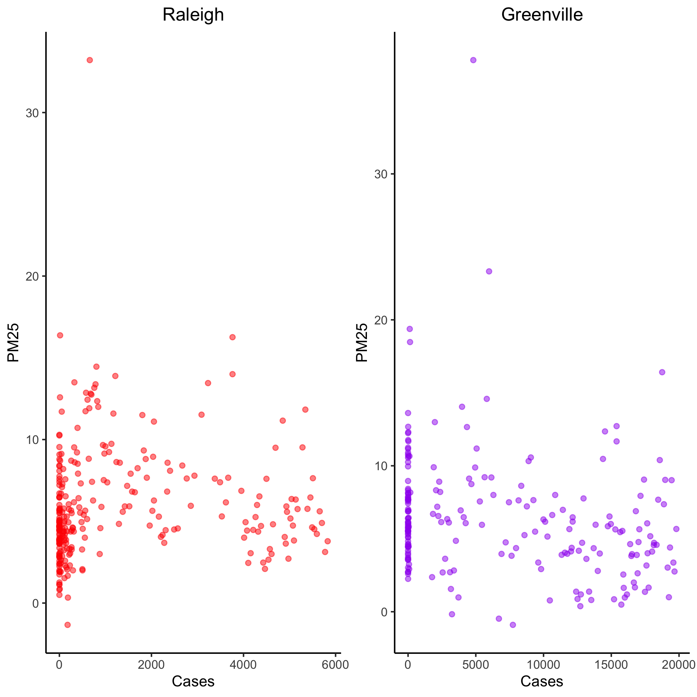
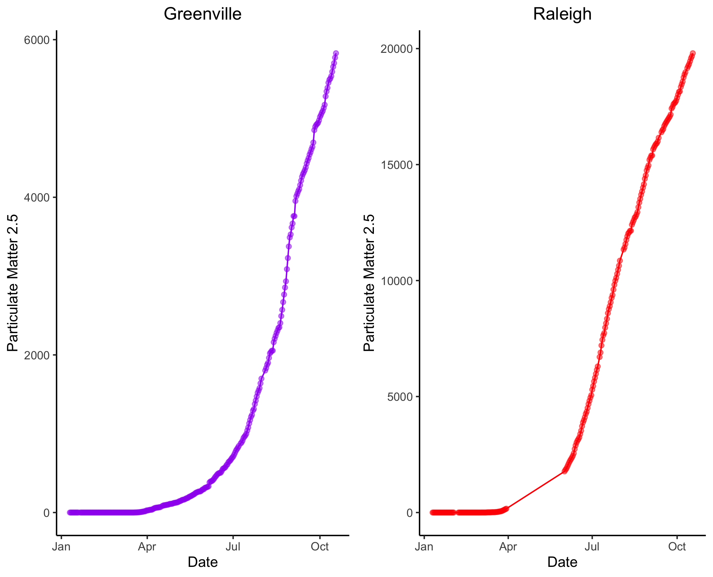
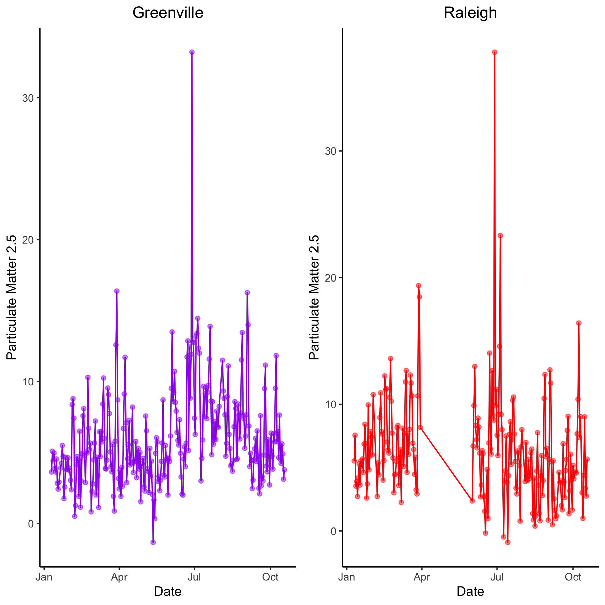

STOR 664 Project
================

Authors
-------

Akshay Sridharan  
Andrew Ackerman  
Matt Johnson  

USAGE
-----
#### Docker
You'll need Docker and the ability to run Docker as your current user.

You'll need to build the container:

    > docker build . -t proj-664-env

This Docker container is based on rocker/verse. To run rstudio server:

    > docker run -v `pwd`:/home/rstudio -p 8787:8787\
      -e PASSWORD=mypass -t proj-664-env
      
Then connect to the machine on port 8787.

#### Make
Use Makefile as recipe book for building artifacts found in derivded directories. 

##### Example:
In local project directory, to build artifact named Raleigh.Clean.csv:

    > make derived_data/Raleigh.Clean.csv
    
Use artifacts before colon as make targets. Dependencies are listed after colon. 

Introduction
------------

Localized air pollution and a global pandemic are two of the most tragically salient realities of the day.  The latter challenges the well-being, livelihood, and accepted societal norms of the current generation while the former threatens the very existence of future generations.  Unfortunately for some, these trends coincide in what must be the nexus of non-ideal respiratory conditions.  Yet, is it possible that out of this bleak forecast, one can glean a positive outcome?  

Even if only temporarily, people confined to their houses and apartments were less compelled to take to the roads.   Intuitively, it would seem that areas with high infection rates would simultaneously see a diminishing rate of air pollutants, particularly carbon monoxide. In particular, our initial hypothesized relation between lagged pollutant counts (as a proxy for human movement) and the number of Covid-19 cases is a negative correlation; this is driven by the idea that a rational citizen’s reaction to an increase in cases would be to minimize excursions to the outside world for the sake of self-preservation.  

Now, undoubtedly, the relative presence of communicable disease is not the only explanatory factor influencing fluctuating levels of air pollutants.  Even still related to the pandemic, other factors such as cultural demographics and political norms may be influential.  That is to say, it is conceivable that areas of historically conservative political leaning would experience minimal (if any) reduction in carbon emissions as a result of drastic outbreak if they fail to enforce quarantining protocols.  For precisely this reason, our analysis will include data from two distinct geographical areas – Raleigh, NC and Columbia, SC.  

Data
----

The data used in this analysis comes from OpenAQ.org.  OpenAQ is an organization that collects and provides data for air quality measurements in 95 countries.  They collect measurements of O3 (Ozone), CO (Carbon Monoxide), NO2 (Nitrogen Dioxide), PM10 (Particulate Matter), PM2.5, SO2 (Sulfur Dioxide), and BC (Black Carbon) in specific locations and publish these results on their website.  By building this open source database of air quality, OpenAQ is encouraging collaboration between scientists across the globe in an attempt to fix air inequalities.  This data is ideal for our analysis because it provides us up-to-date measurements of different air pollutants in our specific locations. Also, since the data is timestamped, we can simply join the air quality data with lagged Covid-19 data to assess trends between the two.  

Covid data taken from: https://usafactsstatic.blob.core.windows.net/public/data/covid-19/covid_confirmed_usafacts.csv  

Data will need to be in Source_Data directory within local repository.  Data needs to be named Raleigh_Air.csv, Columbia_Air.csv, and covid_confirmed_usafacts.csv respecitvely. 

Methodology
-----------

We will employ a number of data reduction and cleaning techniques to ensure that the finalized data set is not so unwieldy as to overburden the analysis tools at our disposal.  That is to say, out of six possible measurements of various types of Air Pollutants, this analysis will focus around one – carbon monoxide.  Carbon monoxide is the air pollutant most directly related to rampant utilization of internal combustion engines.  Thus, while other measures could serve as a viable proxy for automobile usage during pandemic situations, Carbon Monoxide seems to offer a much more intuitive link between our two data sets.  

We have narrowed the time span to include April 2020 through September 2020 with hourly readings averaged across a day to further scale the observation count by a factor of 124.  This was specifically chosen as it coincides with a small time period before the most explicit quarantine policies (such as state-wide stay at home orders) went into effect as well as a more prolonged time after such mandates had been lifted.  Note, this is not to say that the pandemic has been eradicated, or even that it is any less of a poignant threat, in September 2020, only that mandated stay at home orders have largely been lifted and the economy is operating on a modified basis.

Preliminary Plots
-----------------

